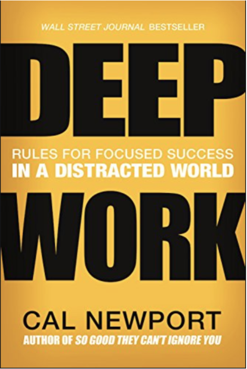

# DEEP WORK

  

어느 한 개발자가 '딥 워크' 책을 적극 권해서 읽게 되었다.  
이 책의 저자가 강조하는 것은 '오래 일하지 마라, 깊게 일하라'이다. 즉, 첫 장부터 책 마지막 장까지 '몰입'에 대해 강조한 책이다.  

여기서 저자는 딥 워크(DEEP WORK)라는 용어를 만들었는데 이에 대한 정의는 "인지능력을 한계까지 밀어붙이는 완전한 집중의 상태에서 수행하는 직업적 활동. 딥 워크는 새로운 가치를 창출하고, 능력을 향상하며, 따라하기 어렵다." 라고 소개한다.  

이 책의 내용은 1부와 2부로 나뉘는데, 1부에서는 딥 워크가 필요한 이유에 대한 내용들이고, 2부에서는 딥 워크를 실행하는 네 가지 규칙에 대한 내용이다.  

1부 딥 워크가 필요한 이유에서는 산만함과 몰입에 대한 생산성, 경쟁력, 그리고 신경과학적 관점과 심리학적 관점, 철학적 관점으로 딥 워크에 접근한다.  

2부 딥 워크를 실행하는 네 가지 규칙에 대한 내용에서는 사람마다 직업적 특성이 각각 다르므로 그 특성에 맞는 몰입 방법 등을 설명하며 무료함, 소셜미디어, 피상적 작업 등에 대해 다룬다.  

직업 특성상 '몰입'을 해야하는 개발자들에게 필독서라 생각한다.
