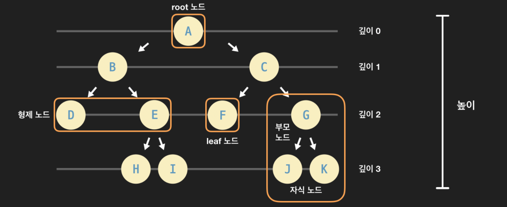

# 1. Tree (트리)

데이터의 상-하 관계를 저장하는 자료 구조이다. 즉, 데이터 사이의 높고 낮음을 나타내는 자료 구조이다.<br>
여기서 상-하 관계는 계층적 관계라 말할 수 있다. 예시) 회사 임직원 데이터 - 피라미드 구조 <br>

트리는 링크드 리스트와 똑같이 여러 개의 노드로 이루어져 있다. <br>
트리 노드는 기본적으로 데이터를 저장하는 하나의 단위이고 하위 관계가 있는 노드들을 가리키는 레퍼런스들을 갖는다. <br>
<br><br>

### 트리 용어

 <br>

root 노드(뿌리 노드): 트리의 시작 노드, 뿌리가 되는 노드를 말한다. 보통 트리를 표현할 때 위 그림처럼 가장 위에 root 노드를 놓는 방식으로 나타낸다.

부모 노드: 특정 노드의 직속 상위 노드이다. 노드 G, J, K가 있는 노란색 박스를 살펴보면 G가 J와 k의 부모 노드이다.

자식 노드: 특정 노드의 직속 하위 노드이다. 부모 노드와 반대되는 개념으로 노드 G, J, K가 있는 노란색 박스를 살펴보면 J와 K가 G의 자식 노드이다.

형제 노드: 같은 부모를 갖는 노드이다. D와 E는 둘 다 부모가 갖기 때문에 서로 형제 노드이다.

leaf 노드 (잎/말단 노드): 자식 노드를 갖고 있지 않은, 가장 말단에 있는 노드이다. 트리의 끝에 있다고 해서 root(뿌리) 노드와 반대되는 표현으로 leaf(잎) 노드라고 부른다. 위 그림에서 노란색 박스로 둘러싼 F가 leaf 노드이다. F뿐만 아니라 D,H,I,J,K 모두 leaf 노드이다.

깊이: 특정 노드가 root 노드에서 떨어져 있는 거리이다. 깊이는 해당 노드로 가기 위해서 root 노드에서 몇 번 아래로 내려와야 하는지를 나타낸다.

레벨: 깊이 + 1. 깊이랑 거의 똑같은 개념이다. 그냥 깊이에 1을 더한 값이다. 레벨 1에 있는 노드들, 레벨 2에 있는 노드들, 이런식으로 특정 깊이인 노드들을 묶어서 표현할 때 사용하는 용어이다.

높이: 트리에서 가장 깊이 있는 노드의 깊이이다. 위 그림의 트리에서는 H,I,J,K가 가장 깊이 있는 노드들이고 그 깊이는 모두 3이다. 그래서 트리의 높이는 3이다.

 <br>

부분 트리(sub-tree): 현재 트리의 일부분을 이루고 있는 더 작은 트리를 말한다. 위 그림의 트리는 root 노드가 A인 트리이다. 그런데 이 트리를 좀 더 작은 단위로 쪼개보면 더 작은 부분 트리들을 발견할 수 있다. 예를 들어 위 그림의 노란색 큰 박스 안을 보면 C가 root 노드인 트리가 있다. 이런 걸 바로 부분 트리라 한다. 지금 C가 A의 오른쪽 자식이기에 노란색 큰 박스 안에 있는 부분트리를 A의 오른쪽 부분 트리라고 할 수 있다. 특정 노드를 root 노드라고 생각하고 바라본다면 여러 가지 부분 트리들을 발견할 수 있다.
<br><br>

### 트리의 활용

1. 컴퓨터 과학의 다양한 문제들을 기발하게 해결

예를 들어 주어진 데이터를 순서대로 재배치시키는 정렬 문제, 용량이 큰 파일을 더 작은 용량으로 저장하는 압축 문제 등

2. 다양한 추상 자료형 구현

트리도 잘 사용하기만 하면 계층적 데이터뿐 만 아니라 다양한 종류의 데이터를 저장하는 추상 자료형을 구현하는 데도 쓸 수 있다. (딕셔너리, 세트, 우선순위 큐 등)

3. 계층적 관계가 있는 데이터를 컴퓨터에서 사용

<br><br>

### 이진 트리

이진 트리에서 '이진'은 이진법이나 이진수처럼 숫자 2에 대한 것이다. <br>
각 노드가 최대 두 개의 자식만 가질 수 있으면 이진 트리라고 부른다. <br>

**이진 트리 구현**

```python
class Node:
    """이진 트리 노드 클래스"""

    def __init__(self, data):
        """데이터와 두 자식 노드에 대한 레퍼런스를 갖는다"""
        self.data = data
        self.left_child = None
        self.right_child = None

"""노드 인스턴스 생성"""
root_node = Node(2)
node_B = Node(3)
node_C = Node(5)
node_D = Node(7)
node_E = Node(11)

"""B와 C를 root 노드의 자식으로 지정"""
root_node.left_child = node_B
root_node.right_child = node_C

"""D와 E를 B의 자식으로 지정"""
node_B.left_child = node_D
node_B.right_child = node_E

"""root 노드에서 왼쪽 자식 노드 받아오기"""
test_node_1 = root_node.left_child

"""노드 B의 오른쪽 자식 노드 받아오기"""
test_node_2 = test_node_1.right_child
```

<br><br>

**이진 트리의 종류**

**정 이진 트리(Full Binary Tree)**


모든 노드가 2개 또는 0개의 자식을 갖는 이진 트리이다.

<br>

**완전 이진 트리(Complete Binary Tree)**


이진 트리에서 노드의 깊이를 레벨이라고 한다면 이진 트리 중에서도 마지막 레벨 직전의 레벨까지는 모든 노드들이 다 채워진 트리를 완전 이진 트리라고 한다. 마지막 레벨에서는 노드들이 다 채워질 필요는 없더라도, 왼쪽부터 오른쪽 방향으로는 노드들이 다 채워져야 한다.

**완전 이진 트리의 높이**


완전 이진 트리 안에 저장된 노드가 n개라고 할 때, 높이는 항상 lg(n)에 비례한다.

| 레벨 | 총 노드수 최솟값                                      | 총 노드수 최댓값                                      |
| ---- | ----------------------------------------------------- | ----------------------------------------------------- |
| 1    | 1                                                     | 1                                                     |
| 2    | 1+1                                                   | 1+2                                                   |
| 3    | 1+2+1                                                 | 1+2+4                                                 |
| 4    | 1+2+4+1                                               | 1+2+4+8                                               |
| 5    | 1+2+4+8+1                                             | 1+2+4+8+16                                            |
| …    | …                                                     | …                                                     |
| h    | $1+2+4+…2^{h-1}+1$ <br> ($2^{h}$, 등비수열 공식 참조) | $1+2+4+…2^{h}$ <br> ($2^{h+1}-1$, 등비수열 공식 참조) |

<br>

**포화 이진 트리(Perfect Binary Tree)**

포화 이진 트리는 모든 레벨이 빠짐없이 다 노드로 채워져있는 이진 트리이다. <br>
모든 레벨이 완벽하게 다 채워져 있기 때문에 영어로는 perfect binary tree 라고 부른다. <br>
포화 이진 트리는 기본적으로 정 이진 트리와 완전 이진 트리의 특성을 모두 갖는다. <br>
포화 이진 트리는

- 높이가 0이면 노드 수가 1개
- 높이가 1이면 노드 수가 (1+2)개
- 높이가 2이면 (1+2+4)개
- 높이가 3이면 (1+2+4+8)개

이런 식으로 그 높이에 따라 노드의 수가 고정된다. 트리의 높이를 h, 노드 수를 n이라고 하면, 높이와 노드 수의 관계를 $n = 2^{h+1}-1$ 이 식의 양 쪽에 1을 더해주면 결국 $n+1 = 2^{h+1}$ 이런 공식이 성립한다.

<br><br>

**완전 이진 트리 배열(파이썬 리스트)로 구현하기**

```python
complete_binary_tree = [None, 1, 5, 12, 11, 9, 10, 14, 2, 10]
```

0번째 인덱스를 None으로 두고, 1번째 인덱스부터 root 노드를 시작으로, 그 다음에 깊이가 1인 노드들을 왼쪽에서 오른쪽 방향순으로, 그 다음에 깊이가 2인 노드들을 왼쪽에서 오른쪽 방향 순으로 차례대로 리스트에 저장하면 된다.

<br>

자식 노드를 찾는 방법

이진 트리에서 각 노드는 기본적으로 자식 노드들을 가리키는 레퍼런스를 가져야 한다. <br>
특정 부모 노드의 왼쪽 자식 노드를 찾고 싶을 때는 부모 노드가 저장된 인덱스에 2를 곱해준 값을 인덱스로 생각하고 리스트에서 찾으면 된다. <br>
특정 부모 노드의 오른쪽 자식 노드를 찾고 싶을 때는 부모 노드가 저장된 인덱스에 2를 곱해준 값에 1을 더해주면 된다.

<br>

부모 노드를 찾는 방법

왼쪽 자식 노드의 부모를 찾으려면 자식 노드가 저장된 인덱스에 2를 나누면 된다. <br>
오른쪽 자식 노드의 부모를 찾으려면 자식 노드가 저장된 인덱스에 2를 나눈 후 정수 값만 가져오면 된다.

완전 이진 트리는 특수한 2가지 성질

- 마지막 레벨 직전의 레벨까지는 노드들로 가득 차 있음
- 마지막 레벨은 왼쪽에서 오른쪽 방향으로 노드들로 가득 차 있어야 함(오른쪽은 비어있어도 되지만 왼쪽은 비어있으면 안 됨)

때문에 이렇게 각 노드를 리스트에 저장한 후에도 부모 노드와 자식 노드를 손쉽게 찾을 수 있다.
