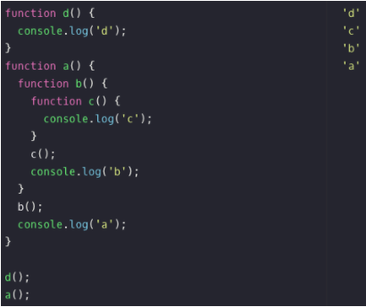
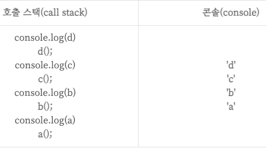
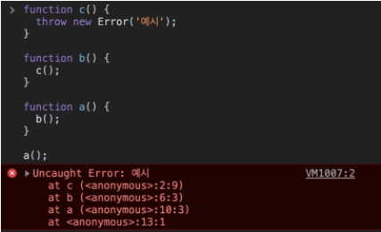
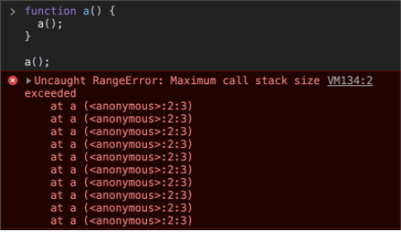
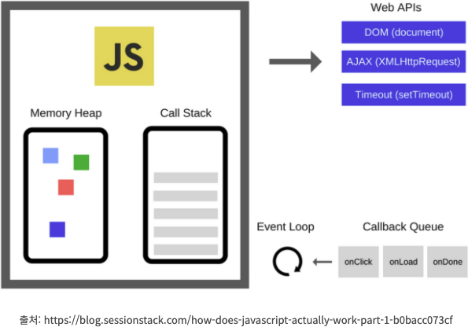
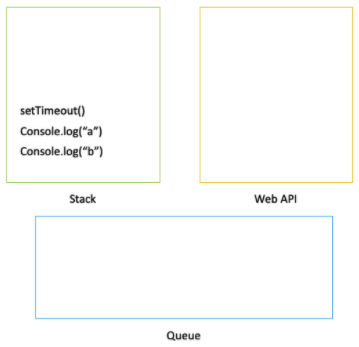
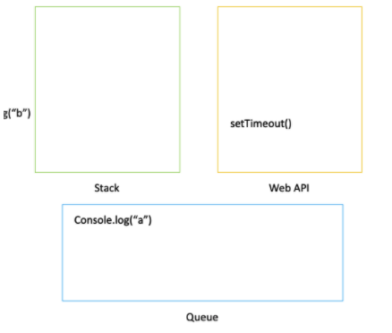

# 1. Call Stack

자바스크립트는 싱글 스레드 프로그래밍 언어이므로, 단일 호출 스택(call stack)이 있다. 따라서 한 번에 하나의 일(Task)만 처리할 수 있다.

콜 스택이란 프로그램에서 함수의 호출들을 기록하는 자료구조이다. 함수를 실행하면 해당 함수의 스택 맨 위에 추가(push)한다. 함수의 결과 값을 반환하면 스택에 쌓여있던 함수는 제거(pop)된다.   

 &nbsp;&nbsp;&nbsp;

함수 실행 코드 순서에 따라 콜 스택에 후입선출식으로 추가(push) 반환을 받는 즉, 콘솔에 출력이 되면 제거(pop)된다.

✨ **point**  
함수를 선언한 게 중점이 아닌 함수를 호출한 것이 중요!  
콜 스택의 각각은 스택 프레임(Stack Frame)이라 한다.(함수가 제거될 때마다 스택이 위에서부터 빠져나가는 것)   

브라우저 콘솔에서 에러 스택들을 표시해 줄 때에도 콜 스택의 현재 상태를 나타낸다. 실패한 함수를 나타날 때에는 스택처럼 top부터 bottom까지 나타낸다. (아래예시)

 

이러한 오류는 예외가 발생했을 때 스택트레이스가 만들어지는 방식이고, 스택 트레이스란 기본적으로 예외가 발생했을 때 콜 스택의 상태이다.
   

## Stack Overflow

함수를 재귀적으로 여러 번 부를 경우 무한 루프에 빠지게 된다. 크롬 브라우저는 16000 프레임의 제한된 스택을 가지고 있어서 이 범위를 넘어서게 되면 아래와 같이 Max Stack Error Reached라는 상태가 되고 실행 중이던 것을 날려버리게 된다. 이걸 스택 날림(Blowing the stack)이라 한다.

   

### 콜 스택의 문제점

단일 스레드, 콜 스택이기 때문에 브라우저에서 복잡한 이미지 처리를 한다면, 이미지 처리 작업 스택을 차지하고 있어서 자바스크립트 후속 작업들을 처리할 수 없게 된다. 그리고 브라우저 호출 스택에서 많은 작업을 처리하기 시작하면 오랜 시간 동안 응답을 멈출 수도 있다. 이러한 문제해결을 위해 비동기 콜백(Asynchronous callbacks) 또는 이벤트 큐(Event Queue)를 쓸 수 있다.

  

## JavaScript Engine   

  

### Heap(힙)  

메모리 할당이 이루어지는 곳이다. 즉, 오브젝트(객체)들은 힙 내부에 할당된다. 힙은 거의 구조화되지 않은 영역(unstructured)의 메모리다. 변수와 객체들의 모든 메모리 할당은 여기서 일어나게 된다.

 

### Web API  

Web API는 브라우저에서 제공하는 API로 DOM, Ajax, Timeout 등이 있다. Call Stack에서 실행된 비동기 함수는 Web API를 호출하고, Web API는 콜백함수를 Callback Queue에 넣는다.

 

### Queue(큐)  

큐는 데이터를 집어넣을 수 있는 선형(linear) 자료형이고 FIFO(First In First Out) 먼저 집어넣은 데이터가 먼저 나오는 특징을 가지고 있다. 그리고 데이터를 집어넣은 enqueue, 데이터를 추출하는 dequeue 등의 작업이 가능하다.  
자바스크립트 런타임은 이러한 메시지 큐를 갖고 있다. 메시지 큐는 실행될 콜백 함수나 실행될 메시지들에 대한 리스트라고 볼 수 있다. 
스택이 충분한 공간(capacity)을 갖고 있을 때, 메시지는 큐 밖으로 나오게 되고 메시지가 가지고 있던 함수 목록들이 실행된다. 이렇게 초기 스택 프레임이 만들어진다. 스택이 빌 때에는 메시지 수행도 끝나게 된다. 이벤트들에 대한 콜백 함수가 제공됐다 가정했을 때, 이 메시지들은 외부 비동기 이벤트들에 대한 응답으로 큐에 쌓이게 된다. (외부 비동기 이벤트들이란, 클릭 이벤트, HTTP 요청 등을 말한다.) 하지만 사용자가 버튼을 눌렀는데 아무런 콜백 함수도 등록되어 있지 않다면 어떠한 메시지도 큐에 들어가지 않게 된다.   

  

콘솔 a가 setTimeout에 있다 생각하고 예를 든다면, 일단 스택에 다 들어가게 된다. 자바스크립트는 이걸 보고 타임아웃 부분을 Web API로 가져간다.(Web API는 브라우저가 관리) 그리고 나서 콘솔 b를 실행시키고 스택이 끝나게 된다.   

  

setTimeout에서 설정한 시간이 1초라 가정한다면, Web API는 1초를 기다리고 콘솔 a는 메시지 Queue로 가게 된다. 만약 스택에 (규칙등) 아무것도 없다면 자바스크립트는 queue를 보고 (콘솔 a구나) 스택에 가게 된다. fetch도 위와 같이 작동한다.
  

## Event Loop  

Event Loop는 Call Stack과 Callback Queue의 상태를 체크해서 Call Stack이 빈 상태가 되면 Callback Queue의 첫 번째 콜백을 Call Stack으로 밀어 넣는다. 이러한 반복적인 행동을 틱(tick)이라 한다.   

## Microtask Queue  

Promise(then)에 등록된 콜백, mutation observer 웹 API에 등록된 콜백 등이 Microtask Queue에 들어온다.   

## Render  

주기적으로 브라우저에서 요소들을 움직이거나 애니메이션을 할 때, 주기적으로 업데이트 해주는 역할을 한다. (그 전에 미리 Request Animation Frame에 쌓인다.)
