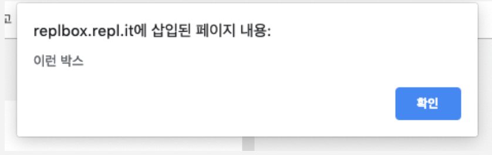

# 1. JavaScript 소개

웹 페이지의 구조를 정의하는 것은 HTML이다. 하지만 HTML만 있다고 웹페이지가 돌아가는 것은 아니다. 우리가 알고 있는 거의 모든 페이지에는 JavaScript 코드가 들어가 있다.

JavaScript는 웹 페이지와 상호작용하도록 만들어진 언어이다.
Front-End 개발자의 역할이 여러 가지 있겠지만,
가장 큰 역할은 JavaScript를 사용하여 웹 페이지를 dynamic 하고 interactive 하게 만드는 일이다.

JavaScript는 브라우저에서 사용자의 행동을 처리하고, 데이터도 저장하고, 네트워크 응답과 요청을 처리하는 역할을 한다.

JavaScript를 실행시키려면

- 브라우저가 존재해야 하고,
- HTML 파일이 있어야 하고,
- HTML 파일에서 JavaScript 파일을 연결시켜줘야 한다.

JavaScript 파일은 확장자가 .js이다.
<br><br>

# 2. 알림 창 띄우기

<br>

<br><br>
위 alert창은 HTML과 CSS 필요없이 JavaScript로 박스를 띄울 수 있다.

```javascript
alert("안녕하세요!");
```

alert창은 로그인 창에서 비밀번호가 틀렸을 때 등 텍스트로 alert창을 보여줄 수 있다.
<br><br>

# 3. console.log()

console.log도 alert와 비슷한 역할을 한다. alert는 사용자에게 안내하고 싶은 텍스트를 보여줬다면, console.log는 개발자가 보고 싶은 것을 출력하는 함수이다.  
그래서 console.log는 일반 사용자가 눈으로 확인할 수 있는 곳에는 보이지 않는다.  
브라우저의 개발자 도구에서 확인할 수 있다.

```javascript
console.log("개발자 도구 확인");
```

참고로 alert와 console.log는 자바스크립트에서 이미 정의된, 약속된 언어이다.  
이렇게 약속된 단어들을 약속어(Reserved Words)라고도 부른다.
