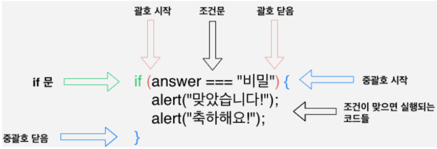
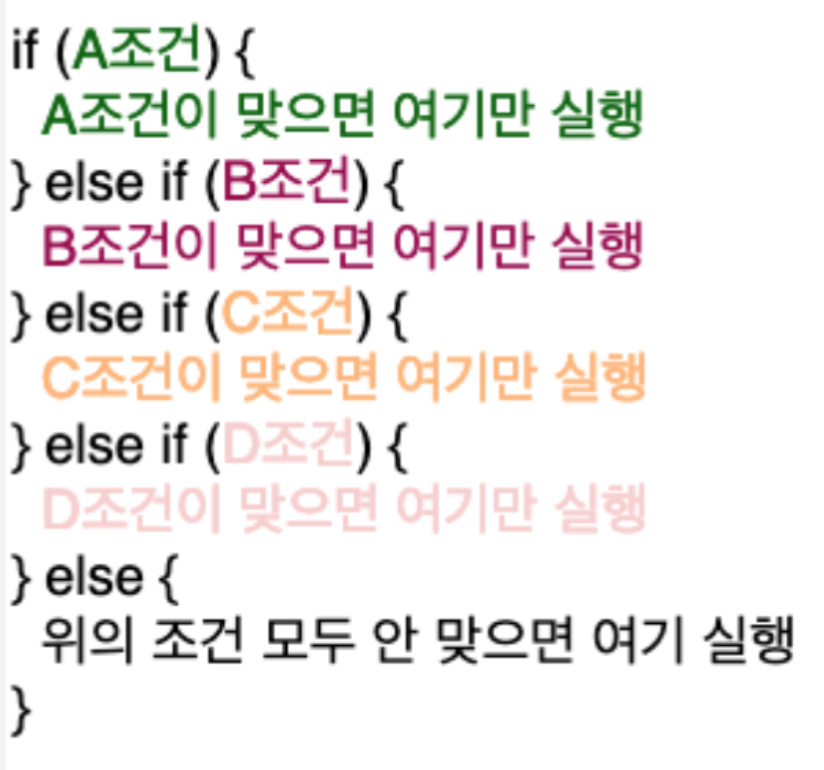
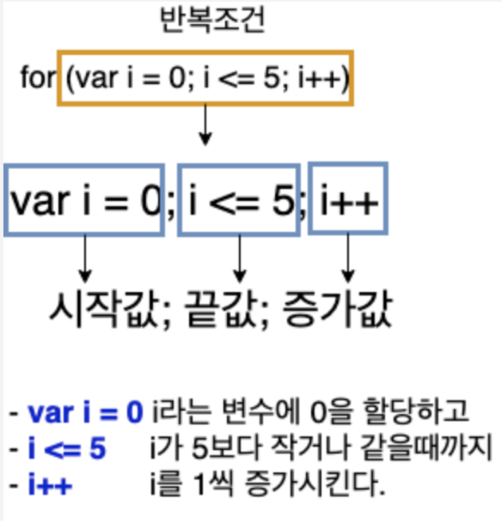

# 1. Operator

```javascript
// 1. String concatenation

console.log('Hello' + 'world'); // Hello world
console.log('1' + 2); // 12
console.log(`string literals: 1 + 2 = ${1 + 2}`); // string literals: 1 + 2 = 3

// 2. Numeric operators

console.log(1 + 1); // add
console.log(1 - 1); // substract
console.log(1 / 1); // divide
console.log(1 * 1); // multiply
console.log(6 % 2); // remainder
console.log(2 ** 5); // exponentiation

// 3. Increment and decrement operators

let counter = 1;
const preIncrement = ++counter;
// 즉, counter = counter + 1;
// preIncrement = counter; 와 같다.

let postIncrement = counter++;
// 즉, postIncrement = counter;
// counter = counter + 1; 와 같다.

// 4. Assignment operators

let x = 1;
let y = 2;
x += y; // x = x + y;
x -= y;
x *= y;
x /= y;

// 5. Comparsion operators

console.log(3 < 2); // less than
console.log(3 <= 2); // less than or equal
console.log(3 > 2); // greater than
console.log(3 >= 2); // greater than or equal

// 6. Logical operators: ||(or), &&(and), !(not)

// ||(or), finds the first truthy value
const a = false;
const b = 5 < 2;
const c = true;

console.log(`or: ${a || b || c}`);

// or 연산자는 true가 하나라도 있으면 true로 계산된다.

// &&(and),finds the first falsy value
console.log(`and: ${a && b && cc}`);

// and 연산자는 모두 다 true가 되어야 true를 리턴하고 그렇지 않으면 false를 리턴한다.

// ! (not)
console.log(!a); // true;

// 7. Equality

const a = '2';
const b = 2;

// == loose equality, with type conversion
console.log(a == b); // true
console.log(a != b); // false

// === strict equality, no type conversion
console.log(a === b); // false
console.log(a !== b); // true

// object equality by reference
const str = { text: 'asd' };
const str1 = { text: 'asd' };
const str2 = str;
console.log(str == str1); // false
console.log(str === str1); // false
console.log(str === str2); // true
```

<br>

# 2. if (조건문)

조건에 따라 실행되는 조건문

<br>

<br><br>

<br><br>

if를 대신할 수 있는 **switch문**도 존재한다.

```javascript
// Switch statement
// use for multiple if checks
// use for enum-like value check
// use for multiple type checks in TS

const a = 'TEST';
switch (a) {
  case 'TEST':
    console.log('hello world');
    break;
  case 'Google':
    console.log('hello google');
    break;
  case 'Firefox':
    console.log('hello Firefox');
    break;
}

// a의 값이 TEST이기 때문에,
// console.log('hello world');
```

<br><br>

# 3. for (반복문)

반복조건에 따라 원하는 만큼 반복시켜주는 반복문

<br>


<br><br>

```javascript
// for loop, for(begin; condition; step)
for (i = 5; i > 0; i--) {
  console.log(`for: ${i}`);
}

// while loop, while the condition is truthy,
// body code is executed.
let i = 5;
while (i > 0) {
  console.log(`while: ${i}`);
  i--;
}

// do while loop, body code is executed first,
// then check the condition.
do {
  console.log(`do while: ${i}`);
  i--;
} while (i > 0);
```
