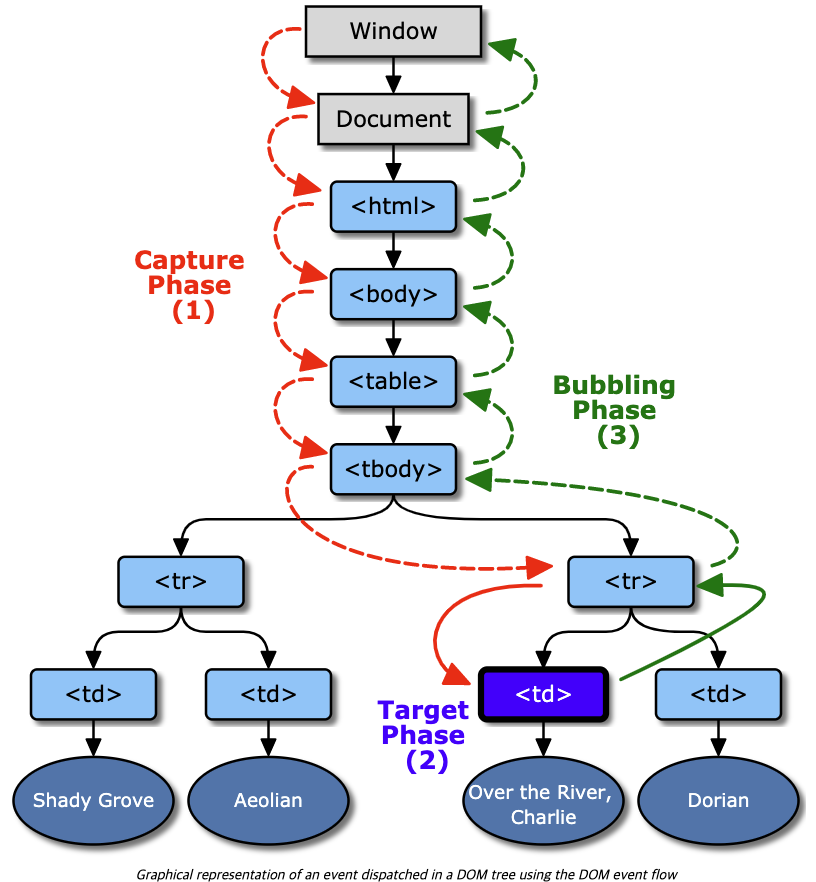

# 1. Bubbling & Capturing

## Event Bubbling

하나의 요소에 이벤트가 발생하면 요소에 할당된 핸들러가 동작하고 이어서 부모 요소의 핸들러가 동작한다. 가장 최상단의 조상 요소를 만날 때까지 이 과정이 반복되면서 요소 각각에 할당된 핸들러가 동작한다. 단, 몇몇 이벤트를 제외하곤 대부분의 이벤트는 버블링 된다. <br><br>

```javascript
// 3개의 요소가 .outer > .middle > button 형태로 중첩된 구조
<div class='outer'>
  <div class='middle'>
    <button>Click Me</button>
  </div>
</div>

// button onclick 핸들러 동작 -> .middle에 할당된 핸들러 동작 -> .outer 할당된 핸들러 동작 -> document 객체를 만날 때까지 각 요소에 할당된 onclick 핸들러 동작.
```

<br>

## event.target

이벤트가 발생한 가장 안쪽의 요소는 타겟(target) 요소라 하고, event.target을 사용해 접근할 수 있다. <br><br>
**event.target과 this(= event.currentTarget) 차이점** <br>
event.target은 실제 이벤트가 시작된 타겟 요소이고, this는 현재 요소이다. event.target은 버블링이 진행되어도 변하지 않고, this는 현재 실행중인 핸들러가 할당된 요소를 참조한다. <br>
즉, event.target은 부모로부터 이벤트가 위임되어 발생하는 자식의 위치, 내가 클릭한 자식 요소를 반환하고, currentTarget은 이벤트가 적용된 부모의 위치를 반환한다. <br><br>

## 버블링 전파 중단하기

핸들러에 이벤트를 처리하고 난 후 버블링을 중단하도록 명령할 수 있다. <br>

- event.stopPropagation
- event.stopImmediatePropagation

<br>

```javascript
// event.stopPropagation
<body onclick='alert(`버블링X`)'>
  <button onclick='event.stopPropagation()'>Click Me</button>
</body>

// 버튼을 클릭해도 body.onclick은 동작하지 않는다.
```

<br>

**event.stopImmediatePropagation** <br>

한 요소의 특정 이벤트를 처리하는 핸들러가 여러 개인 상황에서 핸들러 중 하나가 버블링을 멈춰도 나머지 핸들러는 동작한다. <br> event.stopPropagation는 위쪽의 버블링은 막아주지만, 다른 핸들러들이 동작하는 건 막지 못한다. <br>
요소에 할당된 다른 핸들러의 동작도 멈추려면 event.stopImmediatePropagation을 사용해야 한다. <br><br>

**되도록이면 버블링 전파를 중단하는 메서드들을 사용하지 않는것이 좋다. 중첩 메뉴 또는 부모 컨테이너에서 자식이 클릭 될 때마다 특별한 기능을 수행하는 코드가 있을 시 등등 문제가 발생할 수 있다.**

```javascript
// 버블링 전파 중단 메서드를 쓰지 않고도 간단하게 처리하는 방법
// 내가 중단하고 싶은 이벤트에 아래의 코드를 써준다.

if (event.target !== event.currentTarget) {
  return;
}
```

<br><br>

## Event Capturing

이벤트 캡쳐링은 버블링과 반대 방향으로 진행되는 이벤트 전파 방식이다. <br>
이벤트 흐름에는 3가지 단계가 있는데, 그 중 캡쳐링은 첫 번째 단계이다. (캡쳐링 -> 타겟 -> 버블링)

 <br>

[W3C 참조](https://www.w3.org/tr/dom-level-3-events) <br><br>

이벤트 캡쳐링은 default 값이 false이다. 코드로 구현한다면 addEventListener() API에서 옵션 객체에 capture:true를 설정해주면 해당 이벤트를 감지하기 위해 이벤트 버블링과 반대 방향으로 탐색하게 된다.
