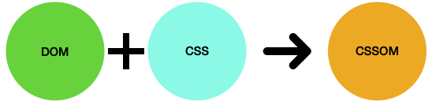
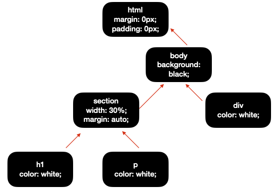

# 1. CSSOM (CSS Object Model)

JavaScript에서 CSS를 조작할 수 있는 API 집합.

HTML처럼 CSS도 브라우저가 이해할 수 있는 형식으로 변환해야 한다.  
브라우저는 DOM을 생성하면 정의해놓은 CSS를 병합하여 CSSOM도 트리 구조를 갖는다.
  

  

CSSOM에는 외부 CSS 외에도 브라우저에서 기본적으로 설정된 모든 속성 값들이 cascading rule(우선순위가 높은 스타일을 적용하는 규칙)에 의해 정의되어 있다.  
이 규칙에 의해 적용된 스타일을 computed styles라고 한다.
  

## CSSOM 구조 예시

   

부모인 html에서 margin과 padding을 0px로 지정하면 cascading rule에 의해 body와 section 등 적용된다. CSSOM에는 계산된 모든 스타일에 관련된 속성들이 포함되어 있다. 

브라우저가 html 파일을 읽게 되면 첫 번째로 DOM Tree를 만들고, CSS 파일을 읽은 후 스타일을 계산하여 CSSOM을 만든다. 
그 후 DOM과 CSSOM을 합쳐 최종적으로 브라우저에 표현될 것들만 render tree로 만들어진다.
 

**opacity가 0이거나 visibility가 hidden 등 요소가 존재한다면 render tree에 포함되지만, display의 속성이 none인 것처럼 브라우저에 표시하지 않는 속성이 있다면 render tree에 포함되지 않는다.**
