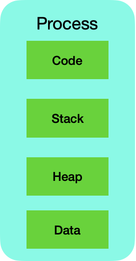
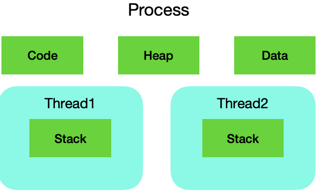

# 1. Process & Thread

## Process

프로세스는 운영체제 위에서 독립적으로 메모리에서 실행되고 있는 프로그램을 말한다. (프로그래밍을 동작하는 최고의 단위)  
그리고 각각의 프로세스는 리소스(자원)들이 정해져 있다. 즉, 프로세스마다 할당된 메모리나 데이터들이 지정되어져 있다. 
여러 개의 프로세스를 사용하는 것을 **멀티 프로세싱**이라고 하며 같은 시간에 여러 개의 프로그램을 띄우는 시분할 방식을 **멀티태스킹**이라고 한다.
  

  프로세스 안에는(구조)  

### Code

프로그램을 위해서 작성된 코드 (프로그램을 실행하기 위한 코드)

### Stack

프로세스 안에서 함수들이 어떤 순서로 실행되어야 하는지, 함수가 종료 되었을 시 어디로 돌아가야 하는지에 대한 정보를 저장

### Heap

오브젝트를 생성하거나 데이터를 만들 때, 그 데이터들이 저장되는 공간 (힙에는 동적으로 할당된 변수들이 저장된다.)

### Data

전역 변수나 스태틱 변수들이 할당되어진다.

  

## Thread

스레드는 프로세스 내에서 실행되는 여러 흐름의 단위이다. 한 프로세스 안에서 여러 개가 동작 가능하다.  (프로그램 안에서 동시에 여러 개가 수행될 수 있는 작은 일꾼 단위)  

  

스레드는 자기들만의 수행해야 되는 함수의 호출을 기억해야 되기 때문에 스레드마다 스택이 할당되어져 있다. 

하지만 프로세스 안에서 동작하는 일꾼들은 결국 한 프로그램을 위해서 일해야 되므로 프로세스에 지정된 코드와 데이터 힙들을 공통적으로 접근해서 공통적으로 업데이트가 가능하다. 

(예시: 음악을 들으면서 사진편집 프로그램을 사용한다면, 각각 음악을 재생하는 스레드 하나와 사진을 편집할 수 있는 스레드, 그리고 다른 스레드에서는 음악의 데이터를 서버에서부터 받아와서 처리하는 일들을 할 수 있다.)

스레드는 동시다발적으로 발생할 수 있기 때문에 프로세스가 효율적으로 일할 수 있도록 도움을 준다.

✨ **point**  
스레드는 일을 수행할 때, 일의 흐름을 기억할 수 있는 고유의 스택이 지정돼 있지만, 데이터나 코드 그리고 힙 같은 공통적인 데이터 리소스는 프로세스에 있기 때문에 스레드들은 이 프로세스에 공통적으로 할당된 리소스에 동시다발적으로 접속해서 동시다발적으로 업데이트해야 하므로 서로 공유하면서 사용한다.    

## MultiProcess

하나의 응용프로그램을 여러 개의 프로세스로 구성하여 각각의 프로세스가 하나의 작업(테스크)을 처리하도록 하는 것이다.  

**장점**  
여러 개의 자식 프로세스 중 한 곳에 문제가 발생해도 다른 프로세스에는 영향받지 않는다.

**단점**  
Context Switching에서의 오버헤드  
context switching 과정에서 캐쉬 메모리 초기화 등 무거운 작업이 진행되고 많은 시간이 소모되는 등의 오버헤드가 발생하게 된다. 
프로세스는 각각의 독립된 메모리 영역을 할당받았기 때문에 프로세스 사이에서 공유하는 메모리가 없어 context switching이 발생하면 캐쉬에 있는 모든 데이터를 리셋하고 다시 캐쉬 정보를 불러와야 한다.

 
context Switching이란 CPU에서 여러 프로세스를 돌아가면서 작업을 처리하는 과정.   (동작중인 프로세스가 대기를 하면서 해당 프로세스의 상태(context)를 보관하고 대기하고 있던 다음 순서의 프로세스가 동작하면서 이전에 보관했던 프로세스의 상태를 복구하는 작업을 말한다.)
   

## MultiThread

하나의 프로세스 내에서 둘 이상의 스레드가 동시에 작업을 수행하는 것을 의미한다.  

**장점**  

- 시스템 자원 소모 감소(자원의 효율성 증대)  
  프로세스를 생성하여 자원을 할당하는 시스템 콜이 줄어들어 자원을 효율적으로 관리할 수 있다.   
- 시스템 처리량 증가(처리 비용 감소) 
  프로세스 통신보다 스레드 간의 통신 비용이 적다.  
  스레드 사이의 작업량이 작아 context switching이 빠르다. 스레드는 프로세스 내 Stack 영역을 제외한 모든 메모리를 공유하기 때문에 통신 부담이 적다.

**단점**  

단일 프로세스 시스템의 경우 효과를 기대하기 어렵다.  
멀티 스레드의 경우 자원 공유의 문제가 발생한다. (동기화)  
하나의 스레드에 문제가 발생하면 전체 프로세스에 영향을 받는다.  디버깅이 까다롭고 주의 깊은 설계가 필요하다.

 

### 멀티 프로세스 대신 멀티 스레드를 사용하면  

멀티 프로세스로 실행되는 작업을 멀티 스레드로 실행할 경우 프로세스를 생성하여 자원을 할당하는 시스템 콜이 줄어들어 자원을 효율적으로 관리할 수 있다.  

스레드는 프로세스 내의 메모리를 공유하기 때문에 독립적인 프로세스와 달리 스레드 간 데이터를 주고받는 것이 간단해지고 시스템 자원 소모가 줄어들게 된다.  

프로세스 간 통신(IPC)보다 스레드 간 통신 비용이 적어 부담이 줄어든다.  

프로세스 간 전환속도 보다 스레드 간 전환속도가 빠르다.
